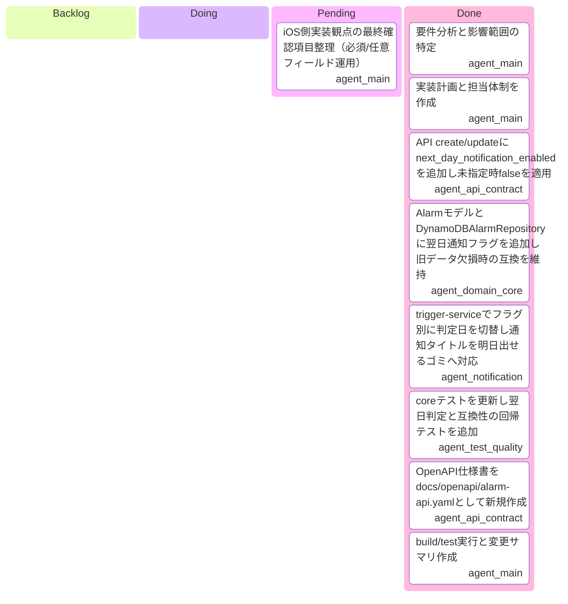

# 明日ゴミ出し通知 実装カンバン

```mermaid
kanban
  backlog[Backlog]

  doing[Doing]

  pending[Pending]
    t009[iOS側実装観点の最終確認項目整理（必須/任意フィールド運用）]@{ assigned: "agent_main" }

  done[Done]
    t001[要件分析と影響範囲の特定]@{ assigned: "agent_main" }
    t002[実装計画と担当体制を作成]@{ assigned: "agent_main" }
    t003[API create/updateにnext_day_notification_enabledを追加し未指定時falseを適用]@{ assigned: "agent_api_contract" }
    t004[AlarmモデルとDynamoDBAlarmRepositoryに翌日通知フラグを追加し旧データ欠損時の互換を維持]@{ assigned: "agent_domain_core" }
    t005[trigger-serviceでフラグ別に判定日を切替し通知タイトルを明日出せるゴミへ対応]@{ assigned: "agent_notification" }
    t006[coreテストを更新し翌日判定と互換性の回帰テストを追加]@{ assigned: "agent_test_quality" }
    t007[OpenAPI仕様書をdocs/openapi/alarm-api.yamlとして新規作成]@{ assigned: "agent_api_contract" }
    t008[build/test実行と変更サマリ作成]@{ assigned: "agent_main" }
```
